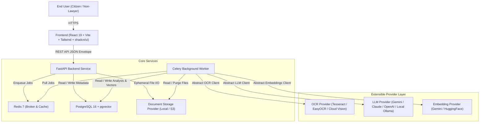
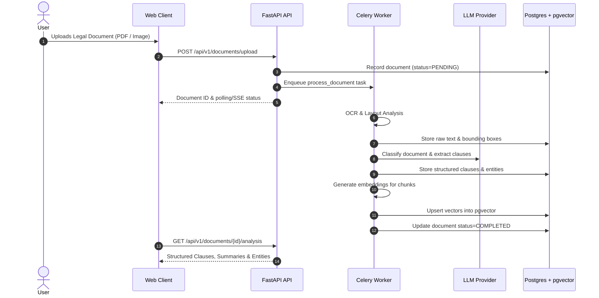
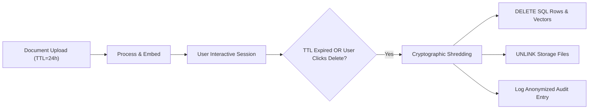

# Kanooni Karhvahi - Architecture Blueprint

> **"A Multilingual Legal-Document Companion for India"**

---

## 1. System Overview

Kanooni Karhvahi is an AI-powered legal document comprehension companion specifically engineered for the Indian legal context. Its primary purpose is to simplify complex legal notices, agreements, court petitions, orders, and contracts into plain language in multiple Indian languages (Hindi, Tamil, Telugu, Bengali, Marathi, Gujarati, Kannada, Malayalam, etc.).

### Critical Boundary & Non-Negotiable Tenets

1. **NOT Legal Advice**: Kanooni Karhvahi is **not a lawyer** and does **not practice law**. It does not forecast case outcomes, provide tactical legal advice, or advocate for a specific legal path.
2. **Document-Grounded Verifiability**: Every summary, explanation, and extracted fact must be strictly anchored to verifiable text in the uploaded document or cited statutes. Unsupported legal claims are prohibited.
3. **Traceability**: The original document must remain visible side-by-side with explanations, with clickable references linking directly to source clauses.
4. **Data Privacy & Ephemeral Retention**: Documents are treated as strictly confidential with strict Time-To-Live (TTL) policies (e.g., 24 hours) after which documents, extracted text, and embeddings are purged.

---

## 2. Why Document-Grounded Rather than a Generic Legal Chatbot?

Generic LLM chatbots suffer from fatal weaknesses when applied to law:
- **Hallucination of Precedents and Provisions**: LLMs frequently invent Section numbers, quote nonexistent Supreme Court judgments, or misapply civil procedures.
- **Jurisdictional Drift**: Legal doctrines vary radically across jurisdictions (e.g., US common law vs. Indian procedural statutes such as CPC, CrPC/BNSS, Evidence Act/BSA). A generic chatbot often blends foreign legal rules.
- **Unauthorized Practice of Law & Liability**: Unbounded advice triggers civil liability and violates bar council ethics.
- **Loss of Evidentiary Grounding**: Legal comprehension requires analyzing the *exact wording* of the specific instrument at hand (e.g., whether an arbitration clause is mandatory, or the exact date a statutory limitation period expires).

**Our Document-Grounded Architecture ensures:**
1. The user's uploaded document is the **single source of truth**.
2. RAG operations retrieve only canonical statutory provisions (e.g., Bharatiya Nyaya Sanhita, Consumer Protection Act, Transfer of Property Act) as supplementary reference points.
3. Chat interactions are context-constrained: questions can only be answered based on the document and official legal source citations.

---

## 3. High-Level Component Architecture

---

## 4. Subsystem Relationships

### 4.1 Frontend / Backend Relationship
- **Frontend SPA**: React 19 + TypeScript + Vite, communicating with the API via TanStack Query and a centralized typed client (`/src/services/api.ts`).
- **Shared Standard API Envelope**:
  - Success: `{ "success": true, "data": T, "error": null }`
  - Error: `{ "success": false, "data": null, "error": { "code": string, "message": string, "retryable": boolean } }`
- **Side-by-side Workspace**: The frontend layout renders the original document PDF/image viewer on the left, and the structured intelligence (classification, clause simplification, key entities, multilingual audio/readouts, and contextual Q&A) on the right.

### 4.2 API / Worker Relationship
- **FastAPI**: Handles authentication, document upload validation, metadata queries, and streaming chat sessions. CPU-heavy or high-latency operations are never run in the request-response cycle.
- **Celery Worker**: Asynchronously executes multi-step document pipelines:
  1. OCR text & layout extraction
  2. Document classification & legal domain tagging
  3. Clause segmentation & simplification
  4. Entity & critical date/amount extraction
  5. Vector chunking & pgvector embedding generation
  6. Multilingual translation & summary generation
  7. Automated TTL privacy cleanup

### 4.3 Database Architecture
- **PostgreSQL 16**: Relational storage for users, documents, processing status, extracted clauses, entities, and audit logs.
- **pgvector Extension**: Stores chunk vector embeddings directly alongside document chunks, enabling semantic hybrid search (vector distance + keyword search) without requiring an external vector database.

---

## 5. Future AI & RAG Pipeline (Planned)

### Retrieval-Augmented Generation (RAG) Strategy:
1. **Document-Internal Retrieval**: Queries match against chunks of the *same document* with cosine similarity, ensuring answers cite specific paragraph and line numbers.
2. **Statutory Reference Retrieval**: Queries involving legal terms match against an indexed corpus of Indian Central and State bare acts (e.g., Specific Relief Act, Negotiable Instruments Act Section 138).
3. **Anti-Hallucination Guardrails**: The prompt template strictly instructs the LLM:
   - "If the document does not mention X, state explicitly: 'This document does not contain information regarding X.'"
   - "Cite the exact clause number for every statement."

---

## 6. Privacy & Deletion Architecture

Legal documents contain highly sensitive Personally Identifiable Information (Aadhaar numbers, PAN, bank accounts, dispute specifics).

1. **Ephemeral Retention**: Documents have a default `DOCUMENT_TTL_HOURS` (configurable, default 24 hours).
2. **Celery Periodic Cleanup**: A Celery Beat / scheduled task scans for expired documents and permanently deletes files and database rows (including vector embeddings).
3. **On-Demand Purge**: Users can click "Delete Document Now" to trigger immediate cascaded deletion across Postgres, pgvector, and storage volumes.
4. **No LLM Training**: All provider integrations must specify zero-data-retention flags (e.g., enterprise Gemini or OpenAI endpoints with data retention disabled).
