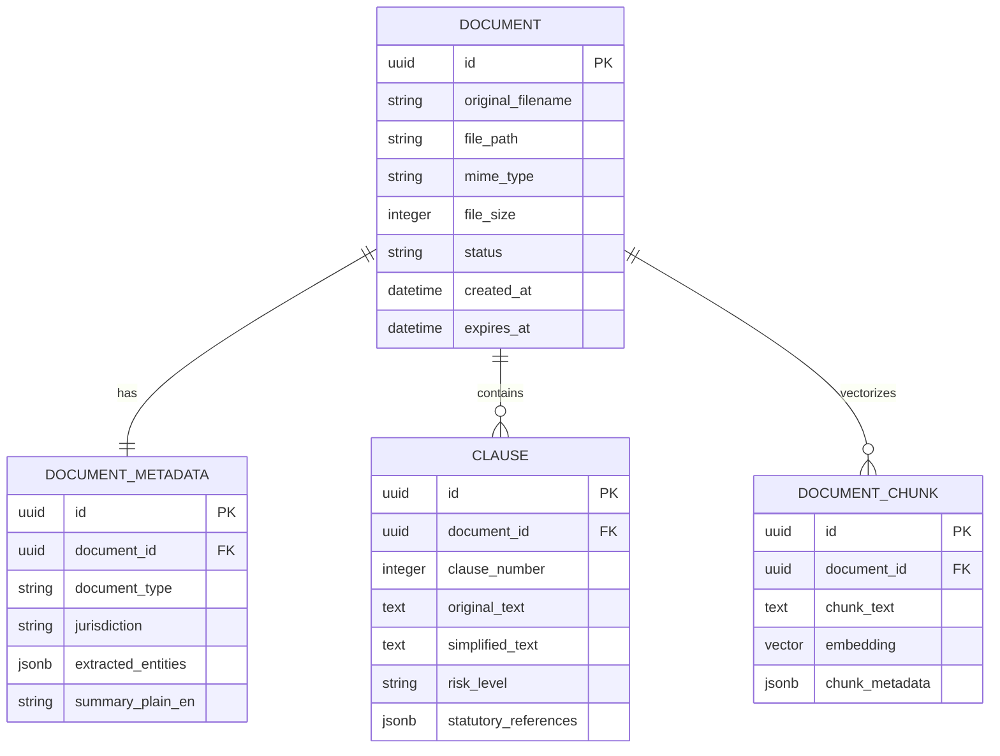

# Kanooni Karhvahi - Database Design

The database uses PostgreSQL 16 with the `pgvector` extension enabled.

---

## Extensions
- `uuid-ossp`: For generating secure, non-sequential UUID primary keys.
- `vector`: Enables vector embeddings (e.g., 768 or 1536 dimensions) for semantic retrieval.

---

## Planned Core Entities (For Future Milestones)



---

## Migrations
Alembic manages all schema revisions under `services/api/alembic/`.
Run migrations using:
```bash
alembic upgrade head
```
